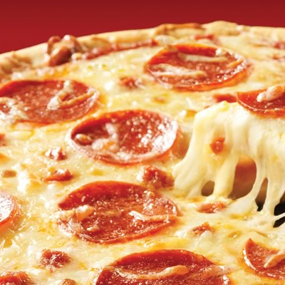

 
 

# Pizzafire
A multithreaded job queue for distributed neural network tasks. Automates the deployment and termination of many AWS EC2 g2.2xlarge instances appropriately to minimize cost. Executes commands and monitors activity over ssh. 

This repo is setup to apply [A Neural Algorithm of Artistic Style](http://arxiv.org/abs/1508.06576) (Gatys, Ecker &amp; Bethge, 2015) to video or very large images.

### Style Transfer

Read more here https://github.com/jcjohnson/neural-style

### Setup
1. Register for AWS: https://aws.amazon.com/

2. Install boto3 and configure AWS credentials. Follow these instructions: https://github.com/boto/boto3

3. Create a security group in AWS console called "ssh-http". 
       *  Enable inbound SSH (tcp port 22)
       *  Enable inbound HTTP (tcp port 80)
       *  Enable outbound all traffic. 

4. Install and run jupyter notebook. http://jupyter.org/
5. Open Pizzafire.ipynb. Configure parameters of job. See *Configure* and *Jobs* sections for examples. 
6. Run all code!

### Configure (from Pizzafire.ipynb)

```python
# VM image we start with
# Everything is already installed on this AMI, it's ready to execute stuff
neuralstyle_ami = "ami-e095ca8a"
# If this no longer works, I have stopped paying to host this AMI. 
# Instead follow these instructions: https://gist.github.com/elad/e3a9e3cc609996b13454

# m3.medium for debugging ($0.07/hour) 
#machine_type = 'm3.medium'
# g2.2xlarge for real processing ($0.65/hour)
machine_type = 'g2.2xlarge'

# how many machines we deploy:
number_of_vms = 4 # Double check your limit for the machine type. 10 is default. 

# how long do we run our VMs? Amazon EC2 bills you by rounding up to the hour. 
maximum_hours = 1
# size of output image style transfer
image_size = 400 # anything over 700 may cause GPU memory error
# number of iterations of style transfer
num_iterations = 400 

# AWS machines use user "ubuntu"
user = "ubuntu"
# randomize jobs, this way if one machine keeps failing (example: not enough available memory)
# it doesn't get stuck with the same job, and other machines will pick up those jobs instead
shuffle_jobs = False
# start time
start_time = time.time()
estimated_process_time = 4*60 # about n minutes per render 
termination_time = start_time + 60*60*maximum_hours
termination_margin = 1.5*60 # give a margin of n minutes for shut down.

jobs = [] # list of jobs 
jobs_lock = False # thread lock used when threads mutate jobs
```

### Jobs (from Pizzafire.ipynb)

```python
# add_to_jobs(style, content, content_is_directory)
# style = local image whose style we are transferring
# content = local content image OR directory containing video frames
# content_is_directory = True | False 

### Applying Style Transfer to still image 
add_to_jobs("inputs/style.png", "inputs/content.png", False)

### Applying Style Transfer to Video
# Split video into individual frame images. VLC or Quicktime can do this. Leave images in their own directory.
add_to_jobs("inputs/style.png", "inputs/video_frame_sequence", True)

### Applying Style Transfer to Large Images
# You will likely run out of GPU memory if you want your output image to be larger than 800px * 800px. 
# Therefore, split a large content image into smaller slices, leave them in their own directory.
# Use ImageSlicer.pynb to do this. Recombine slices later. 
# Set hop_size lower than slice_size to have a blending margin. 
# This is a naive approach, and produces subtle artifacts at edges. 
add_to_jobs("inputs/style.png", "inputs/image_slices", True)

# PIZZAFIRE
add_to_jobs("inputs/pizza.png", "inputs/FireLoop1_seq", True)
```
